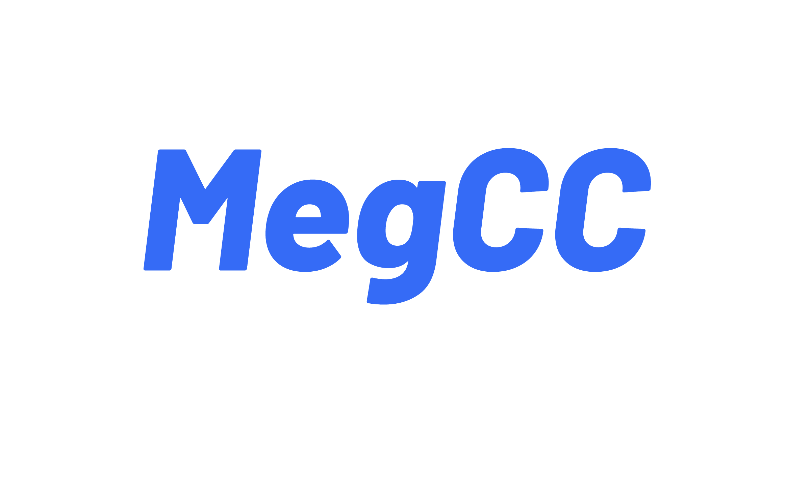
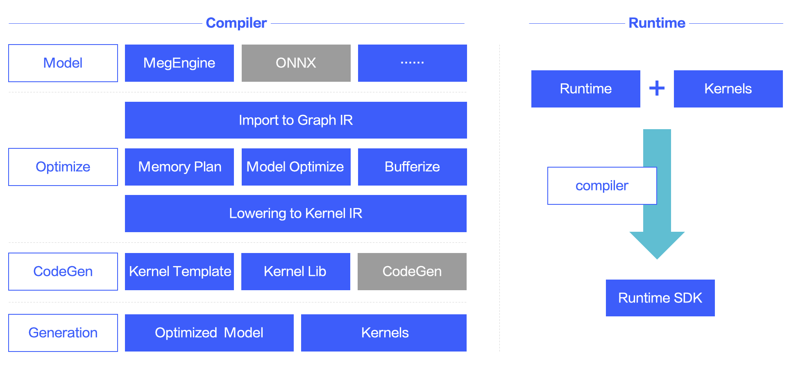

[English README](./README_ENGLISH.md)

## MegCC 特点
MegCC 是一个面向推理的深度学习模型编译器，具有如下特点：
* **极其轻量的运行时库** ：只编译 mobilenetv1 模型进行推理情况下，strip 符号后，整个运行时二进制大小只有 **81KB** 。
* **高性能** ：Arm 上的每一个 Kernel 都是经过人工精心调优的，**同样的模型，性能比 MegEngine 好** 。
* **方便移植**：运行时所有 Code 都是纯 C 代码，可以方便在 Arm，X86，裸板中进行移植。
* **低内存使用，快启动**：模型编译期间会进行内存规划，尽可能的复用内存，并进行静态绑定，减少运行时开销。

## MegCC 框架

MegCC 主要由两部分组成：
* 编译器：负责将模型进行编译，优化，最终生成新模型和对应的 Kernels
* runtime 运行时：运行时需要和生成的 Kernels 结合在一起进行编译，编译完成之后可以加载编译器生成的模型，并计算输出结果

MegCC 模型编译器是基于 MLIR 框架构建起来的，使用 MLIR 的 IR 进行图优化，内存规划以及 Kernel 生成，目前 MegCC 生成的 Kernel 大多数都是
基于人工优化之后写好的模板生成的。MegCC 支持多种场景的模型编译，不仅仅包含静态 shape 编译，而且还支持动态 shape 的编译，多个模型同时编译，以及同一个模型多种 shape 同时编译，另外为了获得极致的最小运行时库，还提供必要的纯 C 形式的 CV 算子生成。

模型编译完成之后，MegCC 会生成两个产物，分别是：
* 优化之后的新模型： 这个模型里面包含整个计算图的信息，以及每一个 Operator 运行时的内存规划信息，输入输出信息，计算 Kernel 的信息
* 运行这些模型对应的 Kernel：上面模型运行时候需要的所有高性能 Kernel 的集合。 

MegCC runtime 会在运行时会加载生成的模型，并调用生成的高性能 Kernel 进行计算，并输出计算结果，目前测试一个可以高效运行 mobilenetv1 的可执行文件大小仅仅只需要 81KB。

MegCC 现在支持的平台处理器平台有 Arm64/ArmV7/X86/risc-v/单片机, 所有支持的 Operator 列表见：[operator lists](doc/opr.md).

## 文档

##### 获取 MegCC 编译器
* 下载提预编译好的 MegCC 模型编译器 [下载 MegCC 编译器](https://github.com/MegEngine/MegCC/releases)

##### 从源码获取 MegCC 编译器
* 如果是开发者需要从源码编译 MegCC 编译器，参考文档 [源码编译 MegCC](compiler/README.md)

##### MegCC 发行新版本
* 如果需要对 MegCC 进行发版，则参考文档 [MegCC 发版](doc/how-to-release.md)

##### 如何使用 MegCC

目前 MegCC 只支持 MegEngine 模型作为输入，其他模型格式可以考虑转到 ONNX，然后通过 [mgeconvert](https://github.com/MegEngine/mgeconvert) 转换到 MegEngine。

* 首次尝鲜，参考 [初次使用](doc/first-use.md)。
* 模型的编译，运行时库编译以及推理执行相关的详细文档，请参考 [使用文档](doc/how-to-use-chinese.md)。

## License

MegCC is licensed under the Apache License, Version 2.0

**Thanks a lot, please enjoy it**
