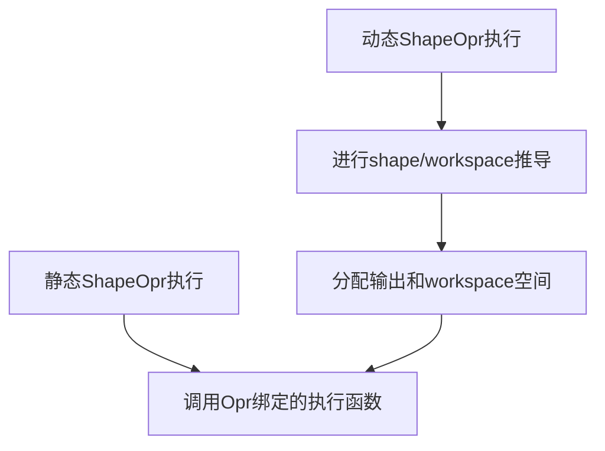
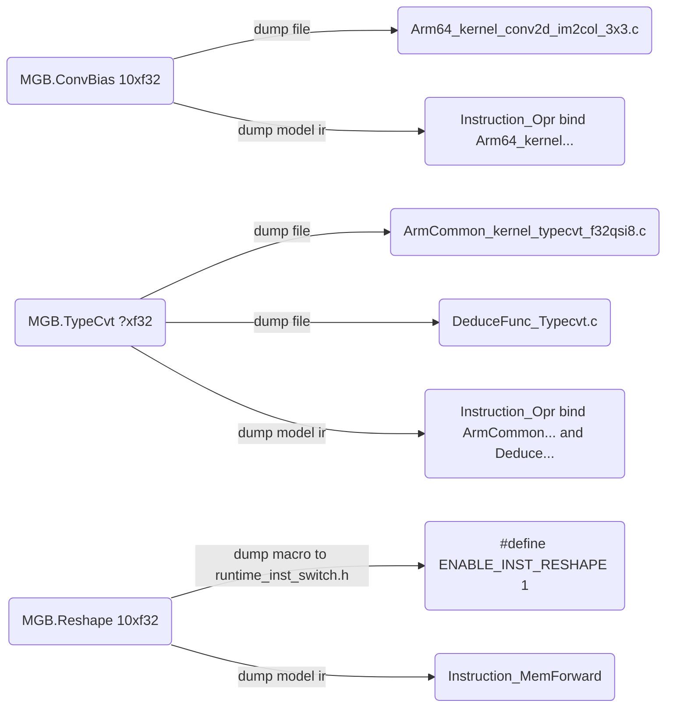
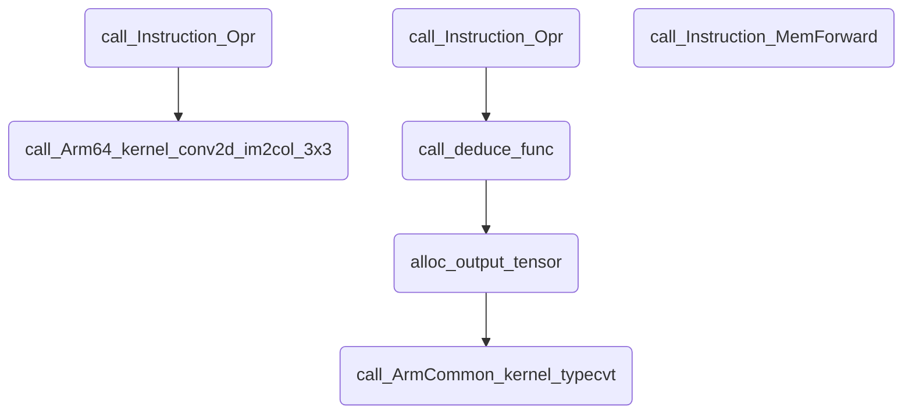
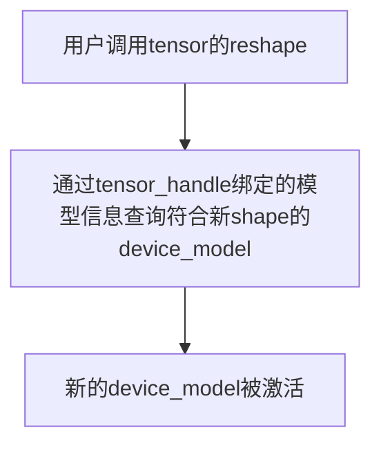

# megcc的动态能力
本文基于[megcc基础原理和执行流程](megcc_arch.md)
## 动态shape  
megcc以静态图为基础，因此opr的shape推导和内存规划都尽量在编译时完成。 但有的opr shape依赖于tensor内的具体数值，需要在运行时推导shape并完成输出tensor的内存分配。比如根据深度学习神经网络中根据输入的landmark坐标对图像做抠图，抠图输出tensor的shape就和输入的landmark tensor中具体的数值有关，该tensor的shape只能在运行时用户填入landmark的具体数值后才能推导。        
### 如何识别动态shape的opr  
如果opr输出shape不可被静态推导，即mlir层面shape中文本层面有`?`或者数值为size_t的最大值，则认为该shape为动态shape， 该opr为动态shape的opr。     
```mlir
%133 = "MGB.Subtensor"(%132, %121, %130, %126, %112) {descs = [[2 : i32, 1 : i32, 2 : i32, 1 : i32, -1 : i32], [1 : i32, 3 : i32, 4 : i32, 1 : i32, -1 : i32]], flags = [[0 : i32, 1 : i32, 1 : i32, -1 : i32, -1 : i32], [0 : i32, 1 : i32, 1 : i32, -1 : i32, -1 : i32]]} : (tensor<1x224x224x3xui8>, tensor<1xf32>, tensor<1xf32>, tensor<1xf32>, tensor<1xf32>) -> tensor<?xui8>
```
### 动态shape opr的生成  
静态shape opr的执行只需kernel，kernel初始化函数和kernel的workspace数值。 动态shape opr还需生成推导opr输出tensor shape的函数，计算workspace的函数。`materializa pass`在kernel生成时为动态shape的opr打上标签生成对应shape推导函数和workspace函数的字符串，export时为动态shape的opr导出对应的shape推导函数和workspace函数。  
例外情况：  
* 某些opr没有静态kernel的实现。如`reshape`，[materializa pass(megcc中给Opr生成并绑定代码实现的过程)](../compiler/lib/Dialect/Kernel/Transforms/KernelMaterialization.cpp)不会为其生成kernel本体和配套的函数。而是把`reshape`转换为`Instruction_MemForward`指令，不再走通用的`Instruction_Opr`指令。导出kernel时打开`ENABLE_INST_MEMFORWARD`的宏开关，这样runtime可以正确识别模型中的`Instruction_MemForward`指令。   

### 动态shape opr的执行  
静态shape opr执行时直接调用kernel本体。 动态shape opr执行时需先调用shape推导，再在runtime里根据推导出的shape分配输出tensor的内存。 还需要调用workspace计算函数（TODO），分配workspace的空间（TODO）。 最后调用对应的静态kernel。  


opr执行封装在runtime的vm/op.c。 如果op绑定了shape推导函数则完成shape推导，推导完后如果tensor被标记为dynamic则调用device的malloc为tensor分配内存。 如果当前tensor已分配空间大于等于shape+dtype要求的空间大小则malloc操作不会被真正执行。 之后为workspace做同样的操作，最后执行opr绑定的kernel完成计算。 opr在卸载时如果输出tensor是dynamic则调用device完成释放(非dyanmic的tensor使用共享tensor空间由vm统一释放)。    
### 举个例子
下面用静态shape的ConvBias，动态shape的TypeCvt、Reshape举例  
编译期dump kernel和模型:     

运行期，根据模型ir完成计算序列:  

从mlir的视角看这个3个例子  
```mlir
// conv的输出shape在编译时可推导，因此其输出内存偏移量可以在编译期计算得到
%247 = "MGB.ConvBias"(%246, %46, %47) {...} : (tensor<1x64x14x14xqsi8<1042367109:1.574803e-01>>, tensor<16x4x4x3x3xqsi8<1008183892:9.256918e-03>>, tensor<1x64x1x1xqsi32<985600783:1.457782e-03>>) -> tensor<1x64x14x14xqsi8<1042367109:1.574803e-01>>
// typecvt的输入%157的shape在编译时未知，无法推导出%158的shape，因此无法给其输出%158预先分配内存
%158 = "MGB.TypeCvt"(%157) {i_dtype = si32, i_scale = 1.000000e+00 : f32, i_zero = 0 : ui8, o_dtype = f32, o_scale = 1.000000e+00 : f32, o_zero = 0 : ui8} : (tensor<?xsi32>) -> tensor<?xf32>
// arg1的指针来自模型外部，这里会用memford_opr把arg1的指针赋给%79
%79 = "MGB.Reshape"(%arg1) {axis = 7 : i32} : (tensor<1x81x2xf32>) -> tensor<1x81x2xf32>
```
## 运行时改变输入shape
megcc以静态图为基础，运行时reshape输入会导致中间tensor的shape要重新推导，kernel要重新绑定，内存要重新规划。因此megcc会在编译时为所有可能用到的输入shape（需用户指定）都规划一份shape、kernel、内存规划的集合。不同输入shape的规划内容以device_model的形式存入模型。   

以mobilenet为例，导入不同batch的mlir表示，不同输入shape的计算图会加上递增的`_X`后缀。mlir层面的func最终会被映射为运行时的device_model。        
```mlir
// mgb-importer mobilenet.cppmodel mobilenet_shape.mlir --input-shapes="data=(1,3,224,224):data=(2,3,224,224)"
  func @mobilenet_shape_0(%arg0: tensor<1x3x224x224xf32> {mgb.func_arg_name = "data"}) -> (tensor<1x1000xf32> {mgb.func_result_name = "cls_softmax"}) {
    %0 = "MGB.ParamProvider"() {name = @"merged56:o0"} : () -> tensor<1x1000xf32>
    ...
    %92 = "MGB.Elemwise"(%90, %91) {mode = 27 : i32} : (tensor<1x1000xf32>, tensor<1x1xf32>) -> tensor<1x1000xf32>
    return %92 : tensor<1x1000xf32>
  }
  func @mobilenet_shape_1(%arg0: tensor<2x3x224x224xf32> {mgb.func_arg_name = "data"}) -> (tensor<2x1000xf32> {mgb.func_result_name = "cls_softmax"}) {
    %0 = "MGB.ParamProvider"() {name = @"merged56:o0"} : () -> tensor<1x1000xf32>
    ...
    %92 = "MGB.Elemwise"(%90, %91) {mode = 27 : i32} : (tensor<2x1000xf32>, tensor<2x1xf32>) -> tensor<2x1000xf32>
    return %92 : tensor<2x1000xf32>
  }
```
运行时不同的device_model都会被初始化，默认0号device_model被激活，有且仅有一个device_model能处于激活状态。用户调用输入tensor的reshape方法后会触发device_model的切换。如果找到与新输入shape匹配的device_model则该device_model会被激活，如果未找到匹配shape的device_model则fatal error退出。  
缺点是dump的模型变大，初始化时间变长。优点是变shape时响应迅速。现在的runtime逻辑不支持一个模型多tensor reshape。     

## 一个模型跑在不同的设备上
通过一个模型包含不同的device_model实现。编译阶段为每种设备（需用户指定）都生成一份对应的kernel、内存规划。不同设备的kernel会被同时输出并写到同一份注册文件。注册文件通过宏来控制哪些kernel被最终注册进去。以Arm64+Armv7为例（dump模型时使用`--arm64v7`），Arm64的kernel用`__aarch64__`的宏包起来，Armv7的kernel以`__arm__`的宏包起来。这样集成megcc的Arm64 SDK不会编译Armv7的kernel，Armv7的SDK也不会编译Arm64的kernel。但这两种SDK都能用同一份megcc的dump文件编译出来。runtime也会根据宏来初始化对应的device_model，未被选择的device_model不会被初始化，这点是和输入变shape的不同。  
下面是开启`--arm64v7`选项后mobilenet的mlir，该选项作用于`kernel-materialization`pass，作用是把kernel的计算图复制一份，老计算图以`#x#_armv7`作为后缀，生成对应的Armv7 kernel。新计算图以`#x#_arm64`作为后缀，生成对应的Arm64 kernel。
```mlir
// mgb-importer mobilenet.cppmodel mobilenet.mlir
// megcc-opt ./mobilenet.mlir --MGB-to-Kernel --finalizing-bufferize --kernel-materialization --arm64v7 > mobilenet_kern.mlir
  func @"mobilenet#x#_armv7"(%arg0: memref<200x3x224x224xf32> {mgb.func_arg_name = "data"}) -> (memref<200x1000xf32> {mgb.func_result_name = "cls_softmax"}) {
    %0 = "Kernel.GetWeight"() {name = @"merged56:o0"} : () -> memref<1x1000xf32>
    ...
    %56 = "Kernel.Reshape"(%arg0) {axis = 7 : i32} : (memref<200x3x224x224xf32>) -> memref<200x3x224x224xf32>
    %57 = memref.alloc() : memref<200x32x112x112xf32>
    %58 = memref.alloc() : memref<654512xi8>
    "Kernel.KernelCall"(%56, %1, %2, %57, %58) {attrMap =..., callee = @Armv7_kernel_conv2d_im2col_3x3_NCHW_DENSE_p1x1_s2x2_d1x1_bias_RELUf32, dynamic_shape = false, operand_segment_sizes = dense<[3, 1, 1]> : vector<3xi32>} : (memref<200x3x224x224xf32>, memref<32x3x3x3xf32>, memref<1x32x1x1xf32>, memref<200x32x112x112xf32>, memref<654512xi8>) -> ()
    ...
    %120 = memref.alloc() : memref<200x1000xf32>
    "Kernel.KernelCall"(%118, %119, %120) {attrMap = {}, callee = @ArmCommon_kernel_elementwise_TRUE_DIV_binary_NAIVE_f32f32f32, dynamic_shape = false, operand_segment_sizes = dense<[2, 1, 0]> : vector<3xi32>} : (memref<200x1000xf32>, memref<200x1xf32>, memref<200x1000xf32>) -> ()
    return %120 : memref<200x1000xf32>
  }
  func @"mobilenet#x#_arm64"(%arg0: memref<200x3x224x224xf32> {mgb.func_arg_name = "data"}) -> (memref<200x1000xf32> {mgb.func_result_name = "cls_softmax"}) {
    %0 = "Kernel.GetWeight"() {name = @"merged56:o0"} : () -> memref<1x1000xf32>
    ...
    %56 = "Kernel.Reshape"(%arg0) {axis = 7 : i32} : (memref<200x3x224x224xf32>) -> memref<200x3x224x224xf32>
    %57 = memref.alloc() : memref<200x32x112x112xf32>
    %58 = memref.alloc() : memref<654512xi8>
    "Kernel.KernelCall"(%56, %1, %2, %57, %58) {attrMap = ..., callee = @Arm64_kernel_conv2d_im2col_3x3_NCHW_DENSE_p1x1_s2x2_d1x1_bias_RELUf32, dynamic_shape = false, operand_segment_sizes = dense<[3, 1, 1]> : vector<3xi32>} : (memref<200x3x224x224xf32>, memref<32x3x3x3xf32>, memref<1x32x1x1xf32>, memref<200x32x112x112xf32>, memref<654512xi8>) -> ()
    ...
    %120 = memref.alloc() : memref<200x1000xf32>
    "Kernel.KernelCall"(%118, %119, %120) {attrMap = {}, callee = @ArmCommon_kernel_elementwise_TRUE_DIV_binary_NAIVE_f32f32f32, dynamic_shape = false, operand_segment_sizes = dense<[2, 1, 0]> : vector<3xi32>} : (memref<200x1000xf32>, memref<200x1xf32>, memref<200x1000xf32>) -> ()
    return %120 : memref<200x1000xf32>
  }
```
这种实现的缺点是模型中包含了两种架构的计算图，会导致模型体积有10KB级别的增长。由于当时mlir的func ir不支持attr，不同的device以func名字后缀的方式表示，新版func ir已经支持用户塞attr进去，可以优化一下。    
