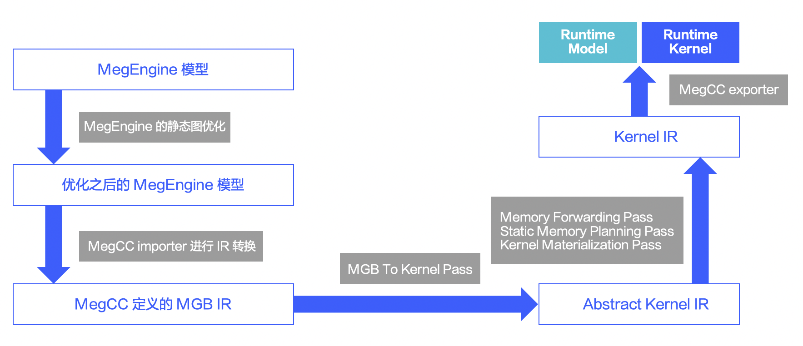
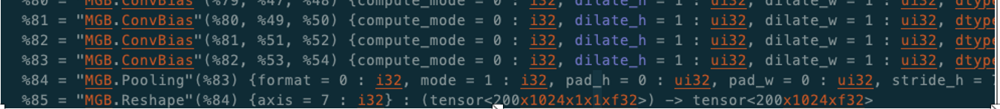
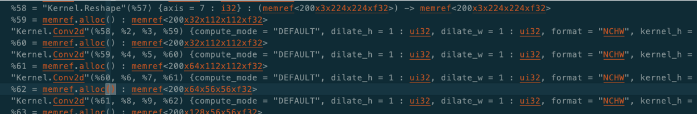
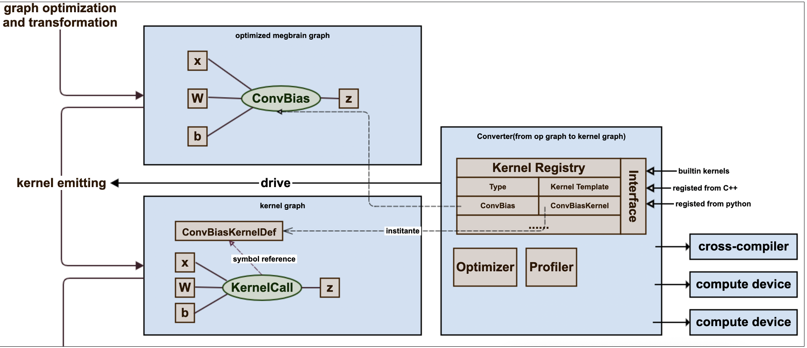
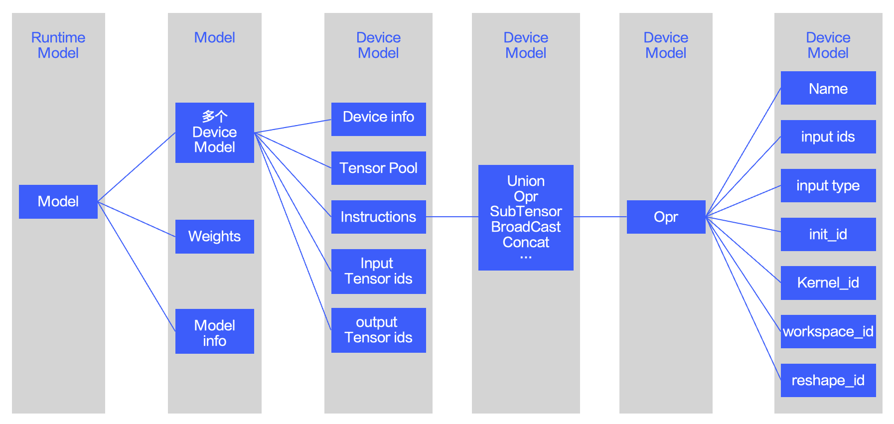
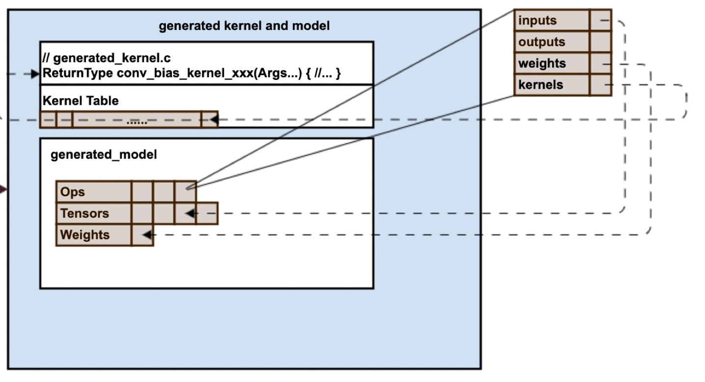
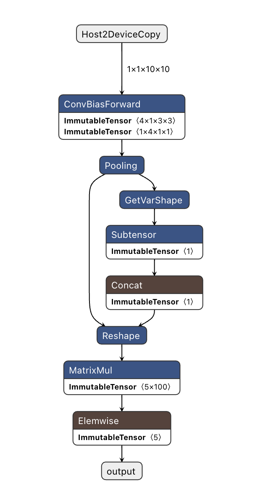

# MegCC Architecture
MegCC实现的原理是：深度学习模型在推理时候，每一个Operator都会对应一个计算kernel并完成计算，所以整个深度学习模型在推理时就是一次执行所有Operator的计算kernel，执行完成之后就可以获得最终推理的结果。传统深度学习推理框架在运行时会做以下几件事情：
* 计算图优化 ----- 主要和模型相关
* Kernel选择 ----- 为模型的每个Operator根据参数选择合适的Kernel进行计算
* 内存分配 ----- 由模型以及模型中每个Operator执行的Kernel决定内存分配的大小
* 执行每个Operator的Kernel ----- 和推理的数据强相关
  
在上述传统深度学习推理需要完成的事情中，图优化，Kernel选择，内存分配都是只和训练好的模型相关和推理时候的输入数据不相关，因此这些工作都可以放在模型编译时完成，运行时仅仅执行每一个Operator的Kernel就可以完成推理。

MegCC就是将上面图优化，Kernel选择，内存分配都放在MegCC的编译阶段完成，将Operator的Kernel计算才放到Runtime中进行计算，这样有以下优势：
* Runtime非常轻量，比起传统的推理框架小一个数量级，因为Runtime只包含了模型中所必须的Kernel，不相关的不会被编译进去
* 提升性能，因为Runtime只做kernel计算，所以避免了不必要的开销
* Kernel性能优化，因为每一个Kernel都是针对每一个Operator定制的，因此可以根据Operator的参数进行更加深入的优化
* 解决Operator fuse之后的算子长尾问题，比如对conv之后融合的activation的种类和数量没有限制，可以支持更多的fuse，也不造成Runtime的大小有明显的改变
* 另外MegCC的runtime使用纯C实现，可以轻松移植到其他的嵌入式芯片中。

MegCC在编译时当完成了图优化之后，首先会进行静态图结构内存规划，然后根据Operator的参数选择合适的Kernel，根据模型的图结构以及每个Kernel的内存需求规划的内存并绑定到每一个Operator的输入输出Tensor上，再根据绑定的Kernel和对应的内存信息生成具体的执行Kernel，这样runtime就可以直接运行这些Kernel就完成推理。但是当遇到动态shape时候，需要一些特殊的处理。

总体来说 MegCC 的整体框架还是很简单的，执行时候主要包含几个步骤
* 使用MegEngine加载模型，然后复用MegEngine的图优化进行模型的图优化
* 将MegEngine图优化完成之后的模型import到使用mlir定义的M'G'B IR中
* 之后将使用mlir定义的多个IR以及优化Pass对整个计算图进行优化，以及对应OP的Kernel生成
* 最后将调用fbs的接口将编译之后的模型序列化，以及将所有的Kernel保存在纯C的源文件中
* 将上述的所有Kernel和runtime一起编译就成了为这个模型定制的非常轻量级的推理框架
  
MegCC主要包含两部分，一部分是compiler部分，另外一部分是runtime部分，下面将分别介绍这两个部分。

## Compiler
Compiler主要运行在我们的开发机上，目前主要支持的是x86的linux系统，并且已经发布了预编译好的可执行文件，用户可以直接下载，既可以完成模型的编译。Compiler主要完成的工作有：
* 模型的导入和导出
* 模型计算图优化
* 模型运行时内存分配
* 模型中所有OP的计算Kernel生成

### Compiler 文件结构
Compier中主要源码在 compiler/lib中，头文件在compier/include文件中，这两个文件中的文件夹结构基本一样，主要区别是一个是源文件，另外一个是头文件，下面是组要文件夹的内容介绍

```
lib
├── CodeGen：使用mlir的基础设施来实现的部分Operator的Kernel自动生成，主要有Matmul和Elemwise的codegen
├── Common：主要存放一些公共的基础代码
├── Conversion：主要完成从MGB IR到 Kernel IR的转变，也就是将MGB IR lowering 到 Kernel IR的过程
│   └── MGBToKernel
├── Dialect：使用mlir定义的方言(IR)，以及使用这些IR进行变换的过程
│   ├── Kernel
│   │   ├── IR
│   │   └── Transforms
│   └── MGB
│       ├── IR
│       └── Transforms
├── KernelGen：预先写好Kernel的模版，下面包含了各个backend的code，包括Arm，裸板
└── Target：主要是compiler导入导出的目标对应的code，导入的目标是MGB，导出的目标是Runtime支持的TinyNN
    ├── MGB
    └── TinyNN
```
### 编译的主要过程
整个模型编译过程经过的图优化和lowering的过程主要是：



#### 主要IR有
* MGB IR：定义为和 MegEngine 中 Operator 一一对应，是MegCC导入进mlir系统的入口IR，它包含了每个Opr的类型以及这个Opr对应的参数，其每一个输入输出变量都是Tensor，并且是单赋值(SSA)的。
* Abstract Kernel IR：抽象Kernel层IR，主要上面MGB IR通过转换之后得到，该IR中的输入输出已经 lowering 到 [Buffer](https://mlir.llvm.org/docs/Bufferization/) 了，因此不再是(SSA)，另外Opr的属性也由 MegEngine 中定义的枚举值，转变成为了字符串。
* Kernel IR：表示已经生成Kernel之后的IR形式，其已经没有Opr的概念，整个计算图通过一个个对应的Kernel链接在一起，opr的参数等都固化在了定义好的Kernel中。其只有有限的几种IR类型：KernelDef，WeightStorage，MemPlan，KernelCall以及Instruction相关IR(支持动态Shape)

下面是这些具体IR的文本形式的图片
* MGB IR

* Abstract Kernel IR

* Kernel IR


#### MegCC中主要的Pass
* MGBToKernelPass：这个Pass主要将MGB IR转换为Abstract Kernel IR，转换过程中主要完成几件事情：
  * 将MGB IR中的所有输入输出 Tensor 类型转换为 Buffer 类型
  * 将MGB IR中的所有枚举参数转换为对应的字符，这样Abstract Kernel IR就可以完全和MegEngine解耦
  * 将一些内存搬运相关的Opr全部转换为Relayout，如：Concat，SetSubtensor等Opr
  * 将判断Opr是静态shape还是动态shape，动态shape就是输入tensor的shape需要依赖输入的值才能计算出来的，如：输出一个tensor中所有大于1的数。如果是静态shape直接转换到Abstract Kernel IR，如果是动态shape直接转换到Kernel IR的Instruction中

* MGBFuseKernelPass：应用在MGB IR上，基于[mlir的模板匹配的方法](https://mlir.llvm.org/docs/PatternRewriter/)尽可能的完成kernel的融合，比如连续两个typecvt合并成为一个typecvt等。
  
* MemoryForwardingPass：将遍历 Abstract Kernel IR 所有可能不用计算，直接share输入内存的opr，如果这些op确实不用计算，则直接forward memory，如果这些op需要进行内存搬运，则会用Relayout opr到替换原来的Opr。
  
* KernelMaterializationPass：将所有Abstract Kernel IR都装载上真正Kernel code并转化为KernelCall，然后添加对应的KernelDef。KernelCall和KernelDef之间通过[symbol](https://mlir.llvm.org/docs/SymbolsAndSymbolTables/)进行匹配。
  
* StaticMemoryPlanningPass：将所有静态shape的memref进行内存规划，内存规划算法使用改进的MegEngine的内存规划算法--PushDown算法，能够极大程度的压缩运行时内存使用量。同时将mlir的memref.Alloc替换为Kernel IR的MemPlan，MemPlan中主要记录了内存规划的一整块memref以及该Tensor在规划的内存中的偏移量

当我们把一个MegEngine编译成为TinyNN的模型过程中，依次执行了：
* MGBFuseKernelPass
* MGBToKernelPass
* MemoryForwardingPass
* KernelMaterializationPass
* StaticMemoryPlanningPass
* KernelFinalCleanPass
* FinalizingBufferizePass
  
上面的 Pass 就完成模型的图优化，以及内存规划，Kernel生成，最终可以根据Runtime中定义的模型格式进行dump编译之后的模型，以及生成的Kernel文件。

### Kernel生成
MegCC Compiler会为中的每个Operator都会生成一个对应的Kernel来完成计算。
* 每一个Kernel都是和具体Operator的一类参数绑定的，如命名为：ArmCommon_chanwise_kernel_conv2d_3x3_NCHW44_GROUP_p1x1_s1x1_d1x1_f32f32f32f32_bias_RELU的Kernel绑定的参数为：kernel = 3x3，stride = 1x1，padding = 1x1 的 channel wise的卷积，并且支持的format是nchw44，数据类型是fp32，后处理是RELU。
* 绝大多数 Kernel 没有和对应的输入Tensor的shape绑定，这样可以让多个参数相同的Operator共享一个Kernel
* 每个Kernel的生成方式有两种：
  * 人工优化之后写好的模板Kernel
  * 使用mlir的基础工具生成的Kernel

目前MegCC中大多数Kernel为人工优化并提前写好的Kernel模板，这些模板会根据具体的Operator参数生成对应的Kernel。大多数为人工优化的Kernel的原因是：目前在CPU上不搜参的情况下，mlir生成的Kernel性能和手写的Kernel还有一定的距离，但是自动生成Kernel的方法长期来看是比较可取的。



如上图所示，Kernel 生成的过程主要是在Kernel Registry中通过Operator的symbol找到对应写好的Kernel Template，然后生成对应的Kernel，Kernel Registry中的Kernel可以来自手工写好的Kernel，可以是通过mlir生成的模型。手动编写的Kernel Template主要使用C++以字符串的形式组织C语言形式的代码，因为C++可以很好的实现模版以及字符串匹配等操作，所以很容易将纯C语言的code拆分成为可以适用多种Operator参数的Kernel，具体实现详见代码，目前实现的所有code都在Compiler中的KernelGen中，目录如下：
```
KernelGen
├── Arm
│   ├── Arm64
│   └── Armv7
├── AutoBareMetal
├── BareMetal
├── Common
├── GeneralIntrinsic：可以支持x86，risc-v，Arm的kernel
├── Jit
└── Utils
```
从上面可以看到，目前MegCC支持了Arm64，Armv7，x86以及risc-v处理器。

## Runtime
Runtime部分主要完成对dump之后的模型进行反序列化，并为每一个Instruction绑定Kernel，以及内存地址等，然后进行inference。Instruction可能是动态shape的某种Operator，也有可能是一个静态shape统一的Operator，Runtime中有一个简单的虚拟机来完成所有的Instruction的计算。Runtime的模型定义如下图所示：



一个深度模型中包含多个device model
* device model 可视作模型的一个可执行对象，这个可执行对象可以用来封装不同shape的执行过程，不同设备的执行过程。device model 主要是为了支持一个模型需要支持多种不同的输入的情况，一种输入shape对应一个device model，另外不同的device model也可以是编译好的不同平台上的模型，如armv7和arm64模型。 
* Instruction 是每个device model中的一些执行指令，这些指令可能是一些动态shape的Operator，以及静态shape的统一Operator，主要有虚拟机来驱动执行
* Opr是Instruction中一种典型的类型，它的input_ids，outut_ids都是model里面的Tensor或者weight的索引，kernel_id和init_id是指这个Opr的kernel在全部kernel中的id，以及init函数的id。


上面是Opr中引用model里面资源进行计算的示意图。

## 一个模型编译的例子
下面准备用MegEngine定义一个的简单模型，然后用MegCC来进行编译，并把一些关键步骤记录下来，这样可以更直观的熟悉MegCC模型编译，以及MegCC定义的IR。

### 获得模型
这里为了方便和简化模型结构，直接使用[MegEngine](https://github.com/MegEngine/MegEngine)定义了一个非常小的模型，主要是小，因为这样方便我们展示各个阶段的IR。

```python
import megengine as mge
import megengine.functional as F
import megengine.module as M
import megengine.jit as jit

import numpy as np

# Define model
class ConvNet(M.Module):
    def __init__(self):
        super().__init__()
        self.conv1 = M.Conv2d(1, 4, 3, padding=1)
        self.pool = M.MaxPool2d(2, 2)
        self.classifier = M.Linear(100, 5)
        self.relu = M.ReLU()

    def forward(self, x):
        x = self.pool(self.relu(self.conv1(x)))
        x = F.flatten(x, 1)
        x = self.classifier(x)
        return x


model = ConvNet()

@jit.trace(symbolic=True, capture_as_const=True)
def fun(data, *, net):
    pred = net(data)
    return pred

data = mge.Tensor(np.random.random([1, 1, 10, 10]).astype(np.float32))

fun(data, net=model)
fun.dump("test_model.mge", arg_names=["data"], optimize_for_inference=True, enable_fuse_conv_bias_nonlinearity=True)
```
安装[MegEngine](https://github.com/MegEngine/MegEngine)之后，用python3 执行上面的python脚本就会在当前目录下面dump一个 test_model.mge的可以用于推理的模型。

> ``warning：`` MegEngine v1.10.0之后的版本dump的模型需要用最新发布的MegCC版本才能成功编译，如果没有最新的MegCC版本可以将上面的fun.dump修改为：

```
fun.dump("test_model.mge", arg_names=["data"], optimize_for_inference=True, enable_fuse_conv_bias_nonlinearity=True,  dump_format="FBS")
```

如果使用MegEngine v1.10.0之后的版本dump的模型，并且没有指定上面的dump_format，则模型dump完成之后，可以直接使用netron对这个模型进行可视化。


### import 模型
这一步主要将上面dump好的MegEngine模型import到MegCC的MGB IR中，使用的工具是MegCC的release包中bin/mgb-importer，执行命令：

```bash
./bin/mgb-importer test_model.mge test_model_mgb_ir.mlir
```
执行完成之后打开test_model_mgb_ir.mlir，结果如下：
```
module {
  "MGB.ParamStorage"() {sym_name = "const{5}[0]", sym_visibility = "private", type = tensor<5xf32>, user_count = 1 : i32, value = dense<0.000000e+00> : tensor<5xf32>} : () -> ()
  "MGB.ParamStorage"() {sym_name = "const{1,4,1,1}[2]", sym_visibility = "private", type = tensor<1x4x1x1xf32>, user_count = 1 : i32, value = dense<0.000000e+00> : tensor<1x4x1x1xf32>} : () -> ()
  "MGB.ParamStorage"() {sym_name = "const{4,1,3,3}[6]", sym_visibility = "private", type = tensor<4x1x3x3xf32>, user_count = 1 : i32, value = dense<[[[[0.163880527, 0.566941559, 0.108093813], [-0.159407943, -0.3#
  "MGB.ParamStorage"() {sym_name = "const{5,100}[30]", sym_visibility = "private", type = tensor<5x100xf32>, user_count = 1 : i32, value = dense<"0x30394EBDE0DF49BEE368773D456F2B3E67A0FCBD9FC3683B3BF4B3BDCAD5B13#
  func @test_model_mgb_ir(%arg0: tensor<1x1x10x10xf32> {mgb.func_arg_name = "data"}) -> (tensor<1x5xf32> {mgb.func_result_name = "classifier.ADD"}) {
    %0 = "MGB.ParamProvider"() {name = @"const{5,100}[30]"} : () -> tensor<5x100xf32>
    %1 = "MGB.ParamProvider"() {name = @"const{4,1,3,3}[6]"} : () -> tensor<4x1x3x3xf32>
    %2 = "MGB.ParamProvider"() {name = @"const{1,4,1,1}[2]"} : () -> tensor<1x4x1x1xf32>
    %3 = "MGB.ParamProvider"() {name = @"const{5}[0]"} : () -> tensor<5xf32>
    %4 = "MGB.Reshape"(%arg0) {axis = 7 : i32} : (tensor<1x1x10x10xf32>) -> tensor<1x1x10x10xf32>
    %5 = "MGB.ConvBias"(%4, %1, %2) {compute_mode = 0 : i32, dilate_h = 1 : ui32, dilate_w = 1 : ui32, dtype = 0 : i32, format = 0 : i32, mode = 0 : i32, nonlineMode = 1 : i32, pad_h = 1 : ui32, pad_w = 1 : ui32#
    %6 = "MGB.Pooling"(%5) {format = 0 : i32, mode = 0 : i32, pad_h = 0 : ui32, pad_w = 0 : ui32, stride_h = 2 : ui32, stride_w = 2 : ui32, window_h = 2 : ui32, window_w = 2 : ui32} : (tensor<1x4x10x10xf32>) -> #
    %7 = "MGB.Reshape"(%6) {axis = 7 : i32} : (tensor<1x4x5x5xf32>) -> tensor<1x100xf32>
    %8 = "MGB.MatrixMul"(%7, %0) {compute_mode = 0 : i32, format = 0 : i32, strategy = 1 : i32, transposeA = false, transposeB = true, workspace_limit = 18446744073709551615 : ui64} : (tensor<1x100xf32>, tensor<#
    %9 = "MGB.Elemwise"(%3, %8) {mode = 16 : i32} : (tensor<5xf32>, tensor<1x5xf32>) -> tensor<1x5xf32>
    return %9 : tensor<1x5xf32>
  }
}
```
这里使用的LLVM的IR结构，参考[LLVM的IR Module组成](https://llvm.org/docs/LangRef.html#id1554)。从上面的IR可以清楚的看到整个模型变成了一个mlir的module，其中模型的入口变成了一个func，还有如下变化：
* 参数全部转换为`MGB.ParamStorage`，并使用 `MGB.ParamProvider` 在 func 中作为接口访问，`MGB.ParamStorage` 和 `MGB.ParamProvider` 通过sym_name联系在一起，如上面 `const{5}[0]` 这个字符就是一个symbol。
* 这个test_model.mge变成了名字为`test_model_mgb_ir`的 func 类型，这个 func 的参数就是整个 test_model.mge的输入Tensor，这里是：`%arg0: tensor<1x1x10x10xf32> {mgb.func_arg_name = "data"}`。
* test_model.mge 中的所有 Operator 一一对应的转换为 MGB IR，如：MGB.ConvBias，MGB.MatrixMul等。
* 在mlir中每个op都有一个输出和对个输入，这些输入输出可以通过链接关系构成一张计算图。

### 将 MGB IR lowering 到 Abstract Kernel IR
继续讲上面import之后的MGB IR转换到 Abstract Kernel IR上，使用的工具是MegCC的release包中bin/megcc_opt，执行命令：

```bash
./bin/megcc-opt --MGB-to-Kernel test_model_mgb_ir.mlir
```
执行完成之后在终端会输出如下内容：
```
module {
  "Kernel.WeightStorage"() {sym_name = "const{5}[0]", type = tensor<5xf32>, user_count = 1 : i32, value = dense<0.000000e+00> : tensor<5xf32>} : () -> ()
  "Kernel.WeightStorage"() {sym_name = "const{1,4,1,1}[2]", type = tensor<1x4x1x1xf32>, user_count = 1 : i32, value = dense<0.000000e+00> : tensor<1x4x1x1xf32>} : () -> ()
  "Kernel.WeightStorage"() {sym_name = "const{4,1,3,3}[6]", type = tensor<4x1x3x3xf32>, user_count = 1 : i32, value = dense<[[[[0.163880527, 0.566941559, 0.108093813], [-0.159407943, -0.351345599, -0.314435512], [-0.423421621, -0.00162138883, -0.227670714]]], [[[0.210816145, -0.147960037, 0.312299728], [-0.216276154, 4.93125059E-4, 0.0709881484], [-0.148768008, -0.472672194, -0.507395864]]], [[[0.0778225958, -0.482131124, -0.245897934], [0.325144351, 0.284748912, -0.466849983], [-0.135587037, -6.329400e-02, -0.453000486]]], [[[0.269852608, 0.10640505, 0.0181340631], [-0.184902608, -0.542481422, 0.457158655], [-0.334687114, 0.750704408, -0.0652677044]]]]> : tensor<4x1x3x3xf32>} : () -> ()
  "Kernel.WeightStorage"() {sym_name = "const{5,100}[30]", type = tensor<5x100xf32>, user_count = 1 : i32, value = dense<"0x30394EBDE0DF49B..."> : tensor<5x100xf32>} : () -> ()
  func @test_model_mgb_ir(%arg0: memref<1x1x10x10xf32> {mgb.func_arg_name = "data"}) -> (memref<1x5xf32> {mgb.func_result_name = "classifier.ADD"}) {
    %0 = "Kernel.GetWeight"() {name = @"const{5,100}[30]"} : () -> memref<5x100xf32>
    %1 = "Kernel.GetWeight"() {name = @"const{4,1,3,3}[6]"} : () -> memref<4x1x3x3xf32>
    %2 = "Kernel.GetWeight"() {name = @"const{1,4,1,1}[2]"} : () -> memref<1x4x1x1xf32>
    %3 = "Kernel.GetWeight"() {name = @"const{5}[0]"} : () -> memref<5xf32>
    %4 = "Kernel.Reshape"(%arg0) {axis = 7 : i32} : (memref<1x1x10x10xf32>) -> memref<1x1x10x10xf32>
    %5 = memref.alloc() : memref<1x4x10x10xf32>
    "Kernel.Conv2d"(%4, %1, %2, %5) {compute_mode = "DEFAULT", dilate_h = 1 : ui32, dilate_w = 1 : ui32, format = "NCHW", kernel_h = 3 : i32, kernel_w = 3 : i32, mode = "CROSS_CORRELATION", nonlineMode = "RELU", operand_segment_sizes = dense<[1, 1, 1, 0, 1]> : vector<5xi32>, pad_h = 1 : ui32, pad_w = 1 : ui32, sparse = "DENSE", strategy = 1 : i32, stride_h = 1 : ui32, stride_w = 1 : ui32, workspace_limit = 18446744073709551615 : ui64} : (memref<1x1x10x10xf32>, memref<4x1x3x3xf32>, memref<1x4x1x1xf32>, memref<1x4x10x10xf32>) -> ()
    %6 = memref.alloc() : memref<1x4x5x5xf32>
    "Kernel.Pool2d"(%5, %6) {format = "NCHW", mode = "MAX", pad_h = 0 : ui32, pad_w = 0 : ui32, stride_h = 2 : ui32, stride_w = 2 : ui32, window_h = 2 : ui32, window_w = 2 : ui32} : (memref<1x4x10x10xf32>, memref<1x4x5x5xf32>) -> ()
    %7 = "Kernel.Reshape"(%6) {axis = 7 : i32} : (memref<1x4x5x5xf32>) -> memref<1x100xf32>
    %8 = memref.alloc() : memref<1x5xf32>
    "Kernel.Matmul"(%7, %0, %8) {compute_mode = "DEFAULT", format = "DEFAULT", transposeA = false, transposeB = true} : (memref<1x100xf32>, memref<5x100xf32>, memref<1x5xf32>) -> ()
    %9 = memref.alloc() : memref<1x5xf32>
    "Kernel.ADD"(%3, %8, %9) : (memref<5xf32>, memref<1x5xf32>, memref<1x5xf32>) -> ()
    return %9 : memref<1x5xf32>
  }
}

```
如上面所述，这里MGB IR全部转换成为了以 Kernel 开头的 Abstract Kernel IR，并且所有的Tensor都消失了，变成了 memref。

### 将 Abstract Kernel IR 装载上 code，并 lowering 到 Kernel IR
从Abstract Kernel IR到Kernel IR的转换过程中，需要执行上面介绍的一些pass，如内存规划的StaticMemoryPlanningPass，以及memory forward的MemoryForwardingPass，以及code装载的KernelMaterializationPass等，执行如下面命令：

```bash
./bin/megcc-opt --MGB-to-Kernel --memory-forwarding --static-memory-planning --kernel-materialization test_model_mgb_ir.mlir
```
执行之后在终端中将输出：

```
#map0 = affine_map<(d0, d1) -> (d0 * 5 + d1 + 20)>
#map1 = affine_map<(d0, d1, d2, d3) -> (d0 * 100 + d1 * 100 + d2 * 10 + d3)>
#map2 = affine_map<(d0, d1, d2, d3) -> (d0 * 400 + d1 * 100 + d2 * 10 + d3)>
#map3 = affine_map<(d0, d1, d2, d3) -> (d0 * 100 + d1 * 25 + d2 * 5 + d3 + 1600)>
#map4 = affine_map<(d0, d1) -> (d0 * 100 + d1 + 1600)>
#map5 = affine_map<(d0, d1) -> (d0 * 5 + d1)>
module {
  "Kernel.KernelDef"() {body = "\0A#include <stdbool.h>....", sym_name = "kernel_conv2d_3x3_NCHW_DENSE_p1x1_s1x1_d1x1_f32f32f32f32_bias_RELU"} : () -> ()
  "Kernel.KernelDef"() {body = "\0A#include <stdbool.h>\0A\0A...", sym_name = "kernel_pooling_MAX_NCHW_p0x0_s2x2_w2x2_f32f32"} : () -> ()
  "Kernel.KernelDef"() {body = "#include <string.h>\0...", sym_name = "naive_kernel_gevmnt"} : () -> ()
  "Kernel.KernelDef"() {body = "\0A                #include \22gi_float.h\22\0A ...)", sym_name = "GI_kernel_elementwise_ADD_binary_VEC_VEC_f32f32f32"} : () -> ()
  "Kernel.WeightStorage"() {sym_name = "const{5}[0]", type = tensor<5xf32>, user_count = 1 : i32, value = dense<0.000000e+00> : tensor<5xf32>} : () -> ()
  "Kernel.WeightStorage"() {sym_name = "const{1,4,1,1}[2]", type = tensor<1x4x1x1xf32>, user_count = 1 : i32, value = dense<0.000000e+00> : tensor<1x4x1x1xf32>} : () -> ()
  "Kernel.WeightStorage"() {sym_name = "const{4,1,3,3}[6]", type = tensor<4x1x3x3xf32>, user_count = 1 : i32, value = dense<[[[[0.163880527, 0.566941559, 0.108093813], ...]]]> : tensor<4x1x3x3xf32>} : () -> ()
  "Kernel.WeightStorage"() {sym_name = "const{5,100}[30]", type = tensor<5x100xf32>, user_count = 1 : i32, value = dense<"0x30394EBDE0DF49BEE3687..."> : tensor<5x100xf32>} : () -> ()
  func @test_model_mgb_ir(%arg0: memref<1x1x10x10xf32> {mgb.func_arg_name = "data"}, %arg1: memref<2000xi8> {mgb.func_arg_name = "kGlobalBuffer"}) -> (memref<1x5xf32, #map0> {mgb.func_result_name = "classifier.ADD"}) {
    %0 = "Kernel.GetWeight"() {name = @"const{5,100}[30]"} : () -> memref<5x100xf32>
    %1 = "Kernel.GetWeight"() {name = @"const{4,1,3,3}[6]"} : () -> memref<4x1x3x3xf32>
    %2 = "Kernel.GetWeight"() {name = @"const{1,4,1,1}[2]"} : () -> memref<1x4x1x1xf32>
    %3 = "Kernel.GetWeight"() {name = @"const{5}[0]"} : () -> memref<5xf32>
    %4 = "Kernel.Reshape"(%arg0) {axis = 7 : i32, determined = true} : (memref<1x1x10x10xf32>) -> memref<1x1x10x10xf32, #map1>
    %5 = "Kernel.MemPlan"(%arg1) : (memref<2000xi8>) -> memref<1x4x10x10xf32, #map2>
    "Kernel.KernelCall"(%4, %1, %2, %5) {attrMap = {compute_mode = "DEFAULT", dilate_h = 1 : ui32, dilate_w = 1 : ui32, format = "NCHW", kernel_h = 3 : i32, kernel_w = 3 : i32, mode = "CROSS_CORRELATION", nonlineMode = "RELU", operand_segment_sizes = dense<[1, 1, 1, 0, 1]> : vector<5xi32>, pad_h = 1 : ui32, pad_w = 1 : ui32, sparse = "DENSE", strategy = 1 : i32, stride_h = 1 : ui32, stride_w = 1 : ui32, workspace_limit = 18446744073709551615 : ui64}, callee = @kernel_conv2d_3x3_NCHW_DENSE_p1x1_s1x1_d1x1_f32f32f32f32_bias_RELU, dynamic_shape = false, operand_segment_sizes = dense<[3, 1, 0]> : vector<3xi32>} : (memref<1x1x10x10xf32, #map1>, memref<4x1x3x3xf32>, memref<1x4x1x1xf32>, memref<1x4x10x10xf32, #map2>) -> ()
    %6 = "Kernel.MemPlan"(%arg1) : (memref<2000xi8>) -> memref<1x4x5x5xf32, #map3>
    "Kernel.KernelCall"(%5, %6) {attrMap = {format = "NCHW", mode = "MAX", pad_h = 0 : ui32, pad_w = 0 : ui32, stride_h = 2 : ui32, stride_w = 2 : ui32, window_h = 2 : ui32, window_w = 2 : ui32}, callee = @kernel_pooling_MAX_NCHW_p0x0_s2x2_w2x2_f32f32, dynamic_shape = false, operand_segment_sizes = dense<[1, 1, 0]> : vector<3xi32>} : (memref<1x4x10x10xf32, #map2>, memref<1x4x5x5xf32, #map3>) -> ()
    %7 = "Kernel.MemPlan"(%arg1) : (memref<2000xi8>) -> memref<1x100xf32, #map4>
    %8 = "Kernel.MemPlan"(%arg1) : (memref<2000xi8>) -> memref<1x5xf32, #map5>
    "Kernel.KernelCall"(%7, %0, %8) {attrMap = {compute_mode = "DEFAULT", format = "DEFAULT", transposeA = false, transposeB = true}, callee = @naive_kernel_gevmnt, dynamic_shape = false, operand_segment_sizes = dense<[2, 1, 0]> : vector<3xi32>} : (memref<1x100xf32, #map4>, memref<5x100xf32>, memref<1x5xf32, #map5>) -> ()
    %9 = "Kernel.MemPlan"(%arg1) : (memref<2000xi8>) -> memref<1x5xf32, #map0>
    "Kernel.KernelCall"(%3, %8, %9) {attrMap = {}, callee = @GI_kernel_elementwise_ADD_binary_VEC_VEC_f32f32f32, dynamic_shape = false, operand_segment_sizes = dense<[2, 1, 0]> : vector<3xi32>} : (memref<5xf32>, memref<1x5xf32, #map5>, memref<1x5xf32, #map0>) -> ()
    return %9 : memref<1x5xf32, #map0>
  }
}
```
上面就是最终编译完成之后的模型：
* 所有的Kernel都以`Kernel.KernelDef`的形式进行定义，在后面将以`Kernel.KernelCall`的形式进行调用，所有的`Kernel.KernelDef`都是以字符串形式存在的纯C code。
* `Kernel.KernelDef`和`Kernel.KernelCall`之间使用symbol进行对应，如上面的`kernel_conv2d_3x3_NCHW_DENSE_p1x1_s1x1_d1x1_f32f32f32f32_bias_RELU`字符。
* 所有的内存资源都是以`Kernel.MemPlan`的形式进行申请，
* 所有Operator的参数都在 `Kernel.KernelCall`以字符串或者数字的形式传递给具体的Kernel
* 每一个`memref`都定义了一个map来指定其在memory plan中的访问逻辑。

将上面的 Kernel IR 按照 Runtime 定义的模型格式进行序列化以及将对应的code字符串写到xxx.c文件中，就完成了整个模型的编译过程。