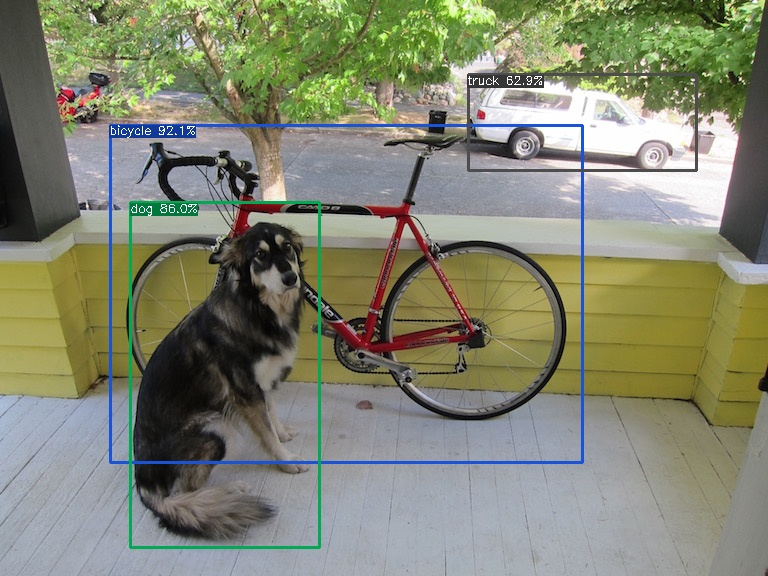

# YOLOX example
## prepare: download MegCC release package
1. the MegCC release package can be get in MegCC Github repo https://github.com/MegEngine/MegCC
2. unzip your MegCC release package into `your_release_MegCC_dir` 

## step1: change directory to yolox_example

``` bash
cd <your_release_MegCC_dir>/yolox_example
```


## step2: get MegEngine yolox pretrained model

``` bash
wget https://github.com/Megvii-BaseDetection/storage/releases/download/0.0.1/yolox_s.mge
```

## step3: convert MegEngine model into MegCC mmodel

```bash
mkdir -p kernel_yolox_s_arm 
#get your model input shape and name
<your_release_MegCC_dir>/bin/mgb-importer yolox_s.mge yolox_s.mlir && cat yolox_s.mlir | grep func
# the output is al follow the input shape is (1,3,640,640) and the name is "data"
# func @yolox_s(%arg0: tensor<1x3x640x640xf32> {mgb.func_arg_name = "data"}) -> (tensor<1x8400x85xf32> {mgb.func_result_name = "head.Dimshuffle"}) {

# build MegCC yolox kernel and MegCC lib for arm 
<your_release_MegCC_dir>/bin/mgb-to-tinynn --json="./yolox_arm.json" --arm64v7
python3 <your_release_MegCC_dir>/runtime/scripts/runtime_build.py --cross_build --kernel_dir ./kernel_yolox_s_arm/ --remove_old_build --cross_build_target_arch aarch64
```

## step4: get the opencv andorid SDK

```bash
wget https://github.com/opencv/opencv/releases/download/4.6.0/opencv-4.6.0-android-sdk.zip
unzip opencv-4.6.0-android-sdk.zip 
mv  OpenCV-android-sdk OpenCV 
```
## step5: build example test
```bash
mkdir -p build_arm64 && cd build_arm64 && mkdir -p install

export NDK_DIR=<your_NDK_DIR> 
cmake .. -DCMAKE_TOOLCHAIN_FILE="${NDK_DIR}/build/cmake/android.toolchain.cmake"  -DANDROID_NDK="$NDK_DIR" -DANDROID_ABI=arm64-v8a  -DANDROID_NATIVE_API_LEVEL=21 -DCMAKE_BUILD_TYPE=Release -DCMAKE_INSTALL_PREFIX=$PWD/install -DRUNTIME_KERNEL_DIR=$PWD../kernel_yolox_s_arm -DOpenCV_DIR=$PWD/../OpenCV/sdk/native/jni/abi-arm64-v8a
make install -j32

```
## step6: run the test 

1. copy the `build_arm64/install/yolox_test`  `yolox_example/dog.png` `yolox_example/kernel_yolox_s_arm/yolox_s.tiny` to your android device(scp over termux or adb push)
2. run test with cmdline:

```bash
./yolox_test yolox_s.tiny --input=dog.png --output=<your_output_image>
```

3. copy `your_output_image` back to your local machine, the result is showed in the image

## result example
origin：


detection example：
